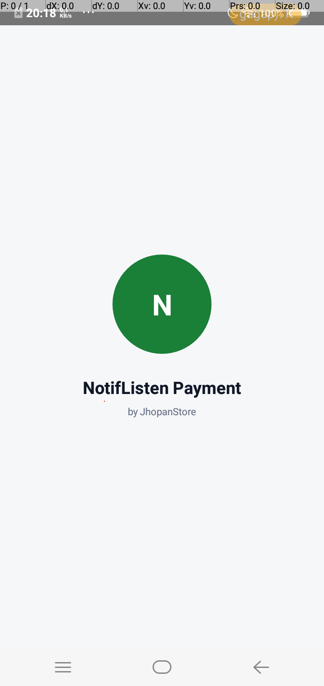
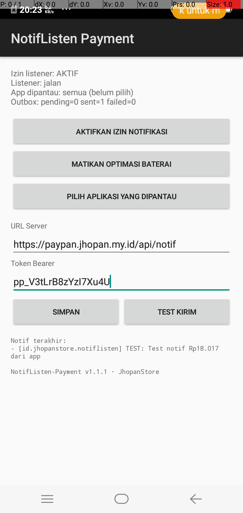
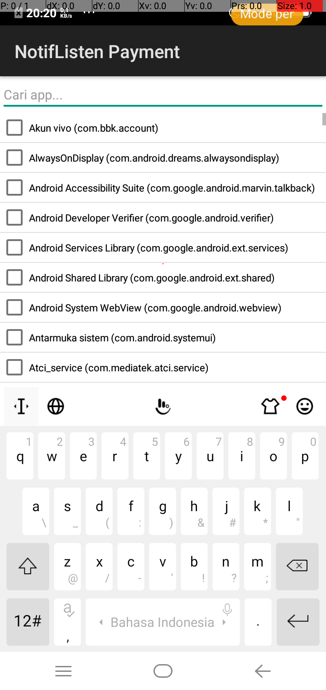
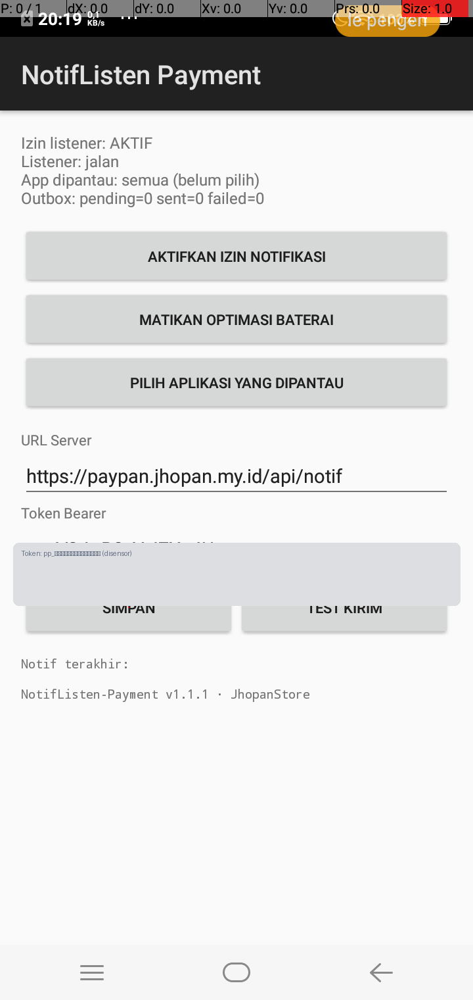
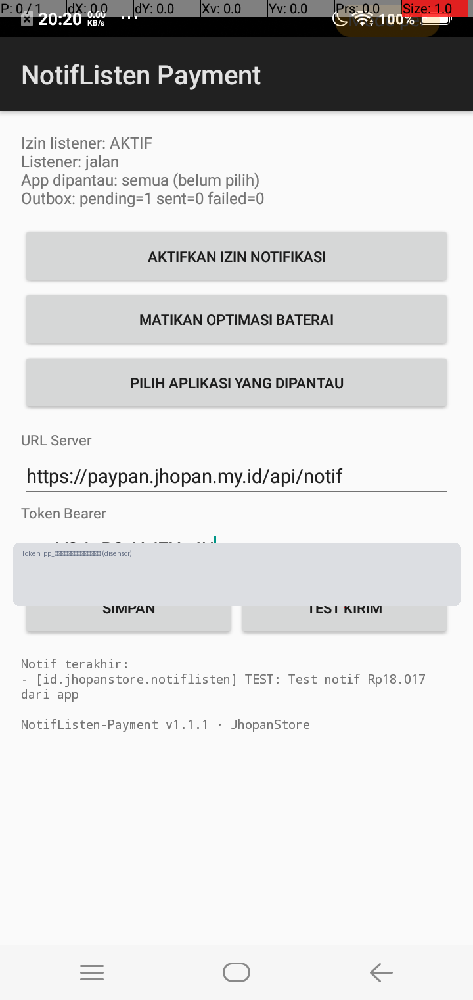

# NotifListen-Payment

<p align="center">
  
  
  
</p>

Aplikasi Android ringan (**zero dependency** — tanpa androidx, tanpa library pihak ketiga) yang menangkap **notifikasi pembayaran** dari app e-wallet/bank (mis. GoPay Merchant), mem-parsing nominalnya, menyimpan ke outbox SQLite, dan mengirim ke server payment gateway.

Pasangan server-nya: [PayPan](https://github.com/jhopan/PayPan) — dokumentasi API integrator ada di [PayPan/API.md](https://github.com/jhopan/PayPan/blob/master/API.md).

**Dikembangkan oleh JhopanStore.**

---

## Cara kerja

```
Notif GoPay Merchant masuk
  → ListenerService (NotificationListenerService)
     → whitelist app (hanya app terpilih)
     → filter non-pembayaran (pencairan/topup/refund di-skip)
     → dedup by sbn.key
     → INSERT outbox SQLite            ← cepat, langsung return
  → SenderService (foreground service)
     → POST JSON ke server (bearer token)
     → retry: gagal jaringan = selalu dicoba ulang (cap umur 48 jam)
     → gagal server = max 8x lalu failed
```

## Fitur keandalan

- Foreground service permanen (ala VPN) + `START_STICKY`
- `BootReceiver` — jalan otomatis setelah HP restart
- Rebind otomatis saat listener terputus + watchdog tiap 5 menit
- Restart saat app di-swipe dari Recents (`onTaskRemoved`)
- Kick instan — notif baru dikirim dalam detik, bukan nunggu tick 60s
- Whitelist per-app yang dipantau (pilih via UI, ada pencarian)
- Parser amount Indonesia: `Rp 1.500.000`, `Rp18.017`, `Rp 5.000,50` — pilih nominal transaksi, bukan saldo
- Filter non-pembayaran: pencairan dana / top up / refund tidak dihitung sebagai pembayaran
- Dedup: notif yang sama (update notif Android) tidak terkirim dobel

## Download

APK siap pakai (release-signed) tersedia di **[Releases](https://github.com/jhopan/NotifListen-Payment/releases/latest)**:

| File | Untuk HP |
|---|---|
| `NotifListen-Payment-v1.1.1-universal.apk` | Semua HP (rekomendasi) |
| `NotifListen-Payment-v1.1.1-v7a.apk` | HP lama 32-bit (armeabi-v7a) |
| `NotifListen-Payment-v1.1.1-v8a.apk` | HP baru 64-bit (arm64-v8a) |

## Setup step-by-step

### 1. Install & buka app

Buka app — splash screen tampil sesaat lalu masuk halaman utama.

<p align="center">
  
</p>

### 2. Aktifkan izin notifikasi

Tekan **AKTIFKAN IZIN NOTIFIKASI** → pilih app ini di setting system. Status di halaman utama berubah jadi `Izin listener: AKTIF`.

### 3. Matikan optimasi baterai

Tekan **MATIKAN OPTIMASI BATERAI** — penting agar listener tidak dibunuh system saat layar mati (terutama Xiaomi/vivo/Oppo).

### 4. Pilih aplikasi yang dipantau

Tekan **PILIH APLIKASI YANG DIPANTAU** → cari & centang app e-wallet/bank (mis. **GoPay Merchant**). Kosong = pantau semua app (tidak disarankan).

<p align="center">
  
</p>

### 5. Isi URL server & token

- **URL Server**: `https://server-anda/api/notif` (endpoint ingest PayPan)
- **Token Bearer**: dari admin PayPan → **Aplikasi & Token** (scope `notif` atau `both`)

Tekan **SIMPAN**.

<p align="center">
  
</p>

### 6. Uji dengan Test Kirim

Tekan **TEST KIRIM** — app membuat satu notif uji dan mengirimkannya ke server. Cek di admin PayPan (dashboard → Notif terakhir) bahwa data masuk. Outbox harus `sent≥1 failed=0`.

<p align="center">
  
</p>

### 7. Selesai — sekarang 24/7

Setiap notif pembayaran dari app yang dipantau otomatis: tertangkap → diparse → tersimpan → terkirim → invoice di server jadi `paid`. HP cukup online (WiFi/data), app jalan di background.

<p align="center">
  
</p>

## Payload yang dikirim ke server

```json
{
  "id": "0|id.jhopanstore.notiflisten|123|a1b2c3d4",
  "pkg": "com.gojek.gopaymerchant",
  "title": "GoPay Merchant",
  "text": "Pembayaran QRIS statis diterima: Rp 18.017 di J Store.",
  "amount": 18017,
  "source": "GoPay Merchant",
  "created_at": 1789042814
}
```

| Field | Arti |
|---|---|
| `id` | ID unik notif (sbn.key + hash konten) — server pakai ini untuk idempoten |
| `pkg` | package name app sumber |
| `title` / `text` | judul & isi notifikasi mentah |
| `amount` | nominal ter-parse (Long, rupiah), `null` kalau tidak terdeteksi |
| `source` | label app (BCA, BRI, GoPay Merchant, DANA, …) dari parser |
| `created_at` | unix timestamp saat notif tertangkap |

Server membalas `200` bila diterima. Detail matching di sisi server: [PayPan/API.md](https://github.com/jhopan/PayPan/blob/master/API.md).

## Konfigurasi tersimpan

- `cfg` prefs: `url`, `token`
- `wl` prefs: daftar package yang dipantau (kosong = semua)

## Build dari source

```bash
./gradlew assembleDebug
# APK: app/build/outputs/apk/debug/app-debug.apk
```

CI otomatis (`.github/workflows/build.yml`): setiap push di-build APK **v7a / v8a / universal** (release-signed via GitHub Secrets) dan dipublish ke rolling release `latest`.

## Troubleshooting OEM (penting untuk 24/7)

| Gejala | Solusi |
|---|---|
| Listener mati setelah beberapa jam (vivo/oppo) | Lock app di Recents + izinkan "background high power" |
| Gak jalan setelah HP restart | Pastikan izin listener aktif → app auto-rebind via BootReceiver; cek status `Listener: jalan` |
| Notif masuk tapi gak terkirim | Cek URL & token; buka app (sender langsung retry); lihat `Outbox: failed` |
| `failed` terus | Server menolak (4xx) — token salah/scope kurang/server down |
| Notif update dianggap notif baru | Sudah ditangani dedup by `sbn.key` + hash |
| Play Protect menghapus app | Pastikan pakai APK release-signed dari Releases, bukan debug |
| Xiaomi: notif app tertentu gak muncul sama sekali | Autostart + "No restrictions" + lock di Recents + izinkan notif lock screen |

Jujur soal batas: app ini **membaca notifikasi**, jadi keandalannya juga bergantung pada app e-wallet yang menampilkan notif (jangan dimatikan channel notif-nya) dan HP yang gak agresif membunuh background process. Semua mitigasi yang bisa dilakukan di sisi app sudah ada.

## Lisensi

MIT

---

## Kredit

**Dikembangkan oleh [JhopanStore](https://github.com/jhopan)**

© 2026 JhopanStore. Dibangun dengan bantuan AI (Hermes Agent).
