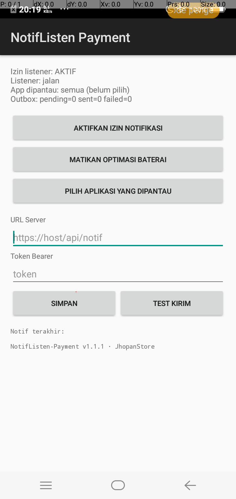

<div align="center">

&nbsp;&nbsp;

# NotifListen-Payment

**Ubah HP jadi mesin konfirmasi pembayaran QRIS.**

Menangkap notifikasi e-wallet → parsing nominal → terkirim ke server —
otomatis, 24/7, tanpa dependency.

[](https://github.com/jhopan/NotifListen-Payment/actions/workflows/build.yml)
[](https://github.com/jhopan/NotifListen-Payment/releases/latest)
[-3b82f6)](https://developer.android.com/about/versions/nougat)
[](#download)

[Download APK](#-download) · [Setup](#-setup-7-langkah) · [Cara kerja](#-cara-kerja) · [Troubleshooting](#-troubleshooting-oem)

</div>

---

## Tentang

Aplikasi Android **ringan dan zero-dependency** (tanpa androidx, tanpa library pihak ketiga) yang berjalan sebagai *notification listener* — memantau notifikasi pembayaran dari app e-wallet/bank yang lo pilih, mengambil nominalnya, dan me-relay ke server gateway.

Pasangan server-nya: **[PayPan](https://github.com/jhopan/PayPan)** — payment gateway QRIS dalam satu binary Go. Dokumentasi API integrator: [PayPan/API.md](https://github.com/jhopan/PayPan/blob/master/API.md).

<div align="center">

| Splash | Halaman utama | Pilih aplikasi |
|:---:|:---:|:---:|
|  |  |  |

</div>

## Cara kerja

```
 Notif e-wallet masuk
   │
   ▼
┌──────────────────────────────────────────────────┐
│  ListenerService (NotificationListenerService)   │
│    ├─ whitelist: hanya app yang dipantau         │
│    ├─ filter: pencairan/topup/refund di-skip     │
│    ├─ dedup: sbn.key + hash konten               │
│    └─ INSERT outbox SQLite  ← cepat, langsung    │
└──────────────────────┬───────────────────────────┘
                       ▼
┌──────────────────────────────────────────────────┐
│  SenderService (foreground service)              │
│    ├─ POST JSON + Bearer token                   │
│    ├─ gagal jaringan → retry selalu (48 jam)     │
│    └─ gagal server → max 8x → failed             │
└──────────────────────────────────────────────────┘
```

### Mengapa desain ini reliable

| Mekanisme | Kegunaan |
|---|---|
| Foreground service + `START_STICKY` | Dibunuh system → hidup lagi sendiri |
| `BootReceiver` | Jalan otomatis setelah HP restart |
| Auto-rebind + watchdog 5 menit | Listener terputus diam-diam → sambung ulang |
| Restart saat di-swipe (`onTaskRemoved`) | Pengguna swipe Recents gak ngefek |
| Instant kick | Notif baru terkirim dalam detik |
| Outbox-first | Notif tersimpan dulu, kirim belakangan — gak ada yang hilang |
| Parser nominal Indonesia | `Rp 1.500.000`, `Rp18.017`, `Rp 5.000,50` — ambil transaksi, bukan saldo |
| Filter non-pembayaran | Pencairan dana / top up / refund tidak dihitung |
| Dedup `sbn.key` | Notif yang di-update Android gak terkirim dobel |

## Download

APK release-signed tersedia di [**Releases**](https://github.com/jhopan/NotifListen-Payment/releases/latest):

| File | Untuk HP |
|---|---|
| `NotifListen-Payment-v1.1.1-universal.apk` | Semua HP — **rekomendasi** |
| `NotifListen-Payment-v1.1.1-v7a.apk` | HP lama 32-bit (armeabi-v7a) |
| `NotifListen-Payment-v1.1.1-v8a.apk` | HP baru 64-bit (arm64-v8a) |

> ⚠️ APK ini release-signed. Kalau sebelumnya pernah pasang versi debug, **uninstall dulu** sebelum install ini.

## Setup (7 langkah)

### 1 · Install & buka

Splash tampil sesaat → masuk halaman utama.

### 2 · Aktifkan izin notifikasi

Tekan **AKTIFKAN IZIN NOTIFIKASI** → pilih app ini di system settings. Status berubah jadi `Izin listener: AKTIF`.

### 3 · Matikan optimasi baterai

Tekan **MATIKAN OPTIMASI BATERAI** — wajib agar listener selamat saat layar mati (krusial di Xiaomi/vivo/Oppo).

### 4 · Pilih aplikasi yang dipantau

**PILIH APLIKASI YANG DIPANTAU** → centang app e-wallet/bank (mis. *GoPay Merchant*). Ada kolom pencarian. Kosong = pantau semua (tidak disarankan).

<div align="center"></div>

### 5 · Isi URL server & token

- **URL Server**: `https://server-anda/api/notif` — endpoint ingest PayPan
- **Token Bearer**: dari admin PayPan → *Aplikasi & Token* (scope `notif` atau `both`)

Tekan **SIMPAN**.

<div align="center"></div>

### 6 · Uji dengan Test Kirim

Tekan **TEST KIRIM** — satu notif uji dibuat & dikirim. Cek dashboard PayPan (*Notif terakhir*) bahwa data masuk. Outbox harus `sent ≥ 1, failed = 0`.

<div align="center"></div>

### 7 · Selesai — jalankan 24/7

Setiap notif pembayaran dari app yang dipantau otomatis tertangkap → diparse → tersimpan → terkirim → invoice di server jadi `paid`. HP cukup online, app bekerja di background.

<div align="center"></div>

## Payload

Yang dikirim ke server (`POST /api/notif`):

```json
{
  "id": "0|com.gojek.gopaymerchant|123|a1b2c3d4",
  "pkg": "com.gojek.gopaymerchant",
  "title": "GoPay Merchant",
  "text": "Pembayaran QRIS statis diterima: Rp 18.017 di J Store.",
  "amount": 18017,
  "source": "GoPay Merchant",
  "created_at": 1789042814
}
```

| Field | Arti |
|---|---|
| `id` | ID unik (sbn.key + hash konten) — kunci idempotensi di server |
| `pkg` | package name app sumber |
| `title` · `text` | judul & isi notifikasi mentah |
| `amount` | nominal ter-parse (rupiah), `null` jika tak terdeteksi |
| `source` | label app (BCA, BRI, GoPay Merchant, DANA, …) |
| `created_at` | unix timestamp saat notif tertangkap |

Server balas `200` = diterima. Detail matching & API server: [PayPan/API.md](https://github.com/jhopan/PayPan/blob/master/API.md).

## Konfigurasi tersimpan

| Prefs | Key | Isi |
|---|---|---|
| `cfg` | `url`, `token` | endpoint server & bearer token |
| `wl` | package names | daftar app yang dipantau (kosong = semua) |

## Build dari source

```bash
./gradlew assembleDebug
# APK: app/build/outputs/apk/debug/app-debug.apk
```

CI (`.github/workflows/build.yml`): setiap push → build APK **v7a / v8a / universal** (release-signed via GitHub Secrets) → publish ke rolling release `latest`.

## Troubleshooting OEM

| Gejala | Solusi |
|---|---|
| Listener mati setelah beberapa jam (vivo/oppo) | Lock app di Recents + izinkan *background high power* |
| Gak jalan setelah restart | Cek izin listener aktif → app auto-rebind via BootReceiver; lihat status `Listener: jalan` |
| Notif masuk tapi gak terkirim | Cek URL & token; buka app (sender langsung retry); lihat `Outbox: failed` |
| `failed` terus | Server menolak (4xx) — token salah / scope kurang / server down |
| Notif update dianggap notif baru | Sudah ditangani dedup `sbn.key` + hash |
| Play Protect menghapus app | Pakai APK release-signed dari Releases, bukan debug |
| Xiaomi: notif app tertentu gak muncul | Autostart + *No restrictions* + lock di Recents + izinkan notif lock screen |

> **Jujur soal batas:** app ini membaca notifikasi — keandalannya bergantung juga pada app e-wallet yang menampilkan notif (jangan matikan channel-nya) dan HP yang tidak agresif membunuh background process. Semua mitigasi di sisi app sudah diterapkan.

## Lisensi

MIT

---

<div align="center">

**Dikembangkan oleh [JhopanStore](https://github.com/jhopan)**

© 2026 JhopanStore

</div>
